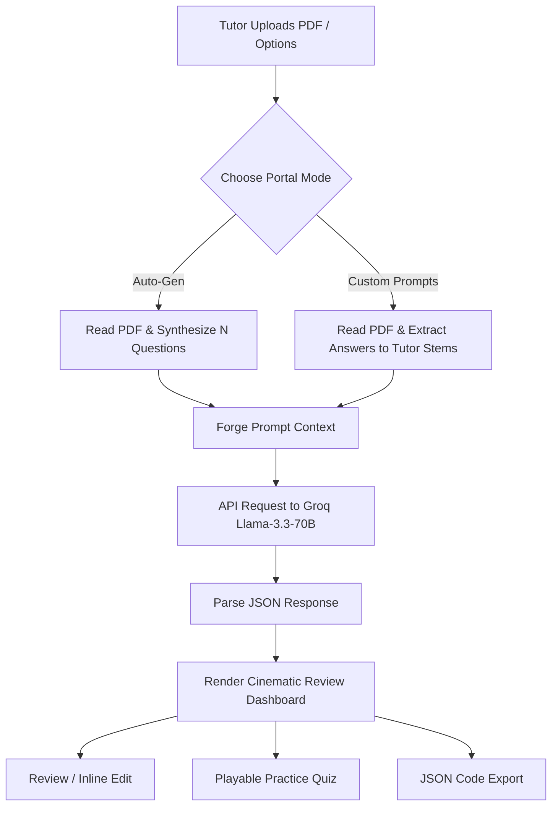

# 🌌 AetherQuiz AI — PDF-to-Interactive Quiz Generator

[](https://react.dev)
[](https://fastapi.tiangolo.com)
[](https://pages.cloudflare.com)
[](https://console.groq.com)

A cinematic, modern, and animated web application built for university tutors and LMS environments. **AetherQuiz AI** processes PDF course syllabus documents, parses their text structures, and uses AI to generate structured multiple-choice questions. 

Tutors can either **auto-generate** comprehensive quizzes or **upload custom question prompts** which the system automatically answers and structures into options (A-D) based on the course materials.

---

## 📸 Key Features

* **⚡ Auto-Gen Mode:** Select a question count (1-20) and let the AI generate high-quality conceptual questions based on your document content.
* **✍️ Custom Prompts Mode:** Input a list of your own open-ended questions. The system scans the PDF text, finds the correct answers, designs plausible distractor options (A-D), and highlights the correct key.
* **🔧 Tutor Editor Console:** Review generated questions, rewrite stems, modify options, and re-assign the correct key interactively in the web dashboard before exporting.
* **🎮 Playable Student Practice:** Tutors can immediately test-run the quiz in a fully animated, slideshow-style student practice interface complete with visual score progress rings.
* **📤 Multiple Export Formats:** Download the quiz as a `.json` file or copy the raw JSON payload to your clipboard for instant importing into LMS platforms (Canvas, Moodle, Blackboard).

---

## 🏛️ System Architecture



---

## 📁 File Structure

```text
Tutor QA/
│
├── frontend/               # React Vite Dev Workspace
│   ├── src/
│   │   ├── App.jsx         # Main dashboard, tab navigation, state, and modules
│   │   ├── App.css         # Flexbox layouts, slider overrides, buttons & glows
│   │   ├── index.css       # Core variables, ambient blobs, and typography
│   │   └── main.jsx        # React entrypoint
│   ├── index.html          # Frontend template & metadata
│   └── vite.config.js      # Build config with relative base path (base: './')
│
├── assets/                 # Compiled Production Assets (placed at root)
├── index.html              # Compiled Entry point (runs directly in browser!)
├── main.py                 # FastAPI Server, text extractor, and Groq API connector
├── requirements.txt        # Python backend dependencies
├── .gitignore              # Repository cleanup guidelines (logs, node_modules, envs)
└── .env.example            # Environment variables placeholder
```

---

## 🚀 Quick Start (Local Setup)

### 1. Set Up the Backend
1. Install Python 3.10+ and backend dependencies:
   ```bash
   pip install -r requirements.txt
   ```
2. Obtain a free API Key from [console.groq.com](https://console.groq.com) (no credit card required).
3. Create a `.env` file in the project root:
   ```env
   GROQ_API_KEY=gsk_your_key_here
   ```
4. Boot the FastAPI server:
   ```bash
   uvicorn main:app --reload --port 8000
   ```
   *Verify it's online by opening `http://localhost:8000/`*

### 2. Set Up the Frontend

#### Option A: Local Dev Server (Recommended)
1. Navigate into the frontend folder:
   ```bash
   cd frontend
   npm install
   npm run dev
   ```
2. Open `http://localhost:5173` in your browser.

#### Option B: Standalone Production Build
Double-click the root [index.html](file:///A:/Tutor%20QA/index.html) file to open the pre-compiled, standalone production bundle directly in any web browser!

---

## 🌐 Deploying to Production (100% Free Stack)

You can host this entire system online at no cost with zero credit cards required:

### 1. Frontend: Cloudflare Pages
Cloudflare Pages is the fastest place to host React sites. It has **no cold starts** (loads instantly) and unlimited bandwidth.
1. Run the deployment script inside the `frontend/` folder:
   ```bash
   cd frontend
   npx wrangler pages deploy dist
   ```
2. Log in securely through your browser when prompted.
3. Wrangler will upload the precompiled bundle and print your public URL (e.g. `https://aether-quiz.pages.dev`).

### 2. Backend: Render.com
1. Create a free account at [Render.com](https://render.com).
2. Create a **New Web Service** linked to your GitHub repository.
3. Configure the settings:
   * **Runtime:** `Python`
   * **Build Command:** `pip install -r requirements.txt`
   * **Start Command:** `uvicorn main:app --host 0.0.0.0 --port $PORT`
4. Add the following **Environment Variable**:
   * Key: `GROQ_API_KEY` | Value: *(Your Groq key)*
5. Deploy. Paste your Render API URL into the **API Configuration** settings inside your online web app!
